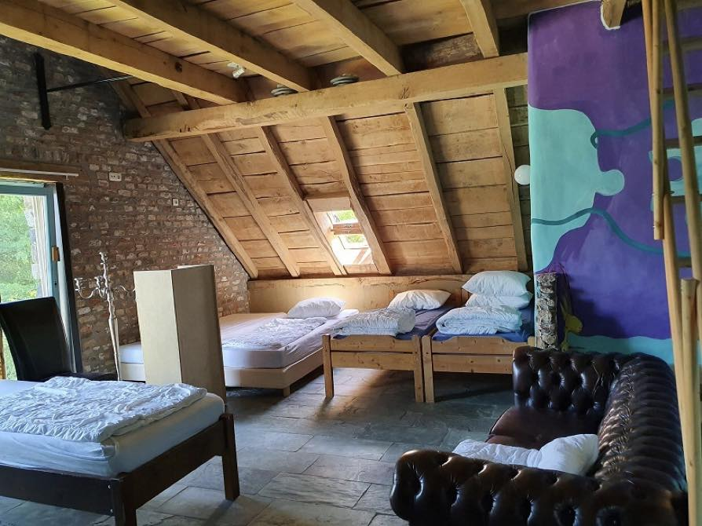
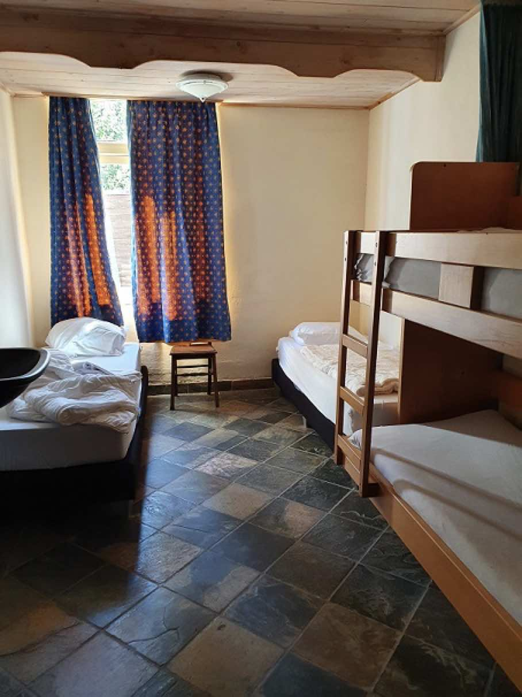
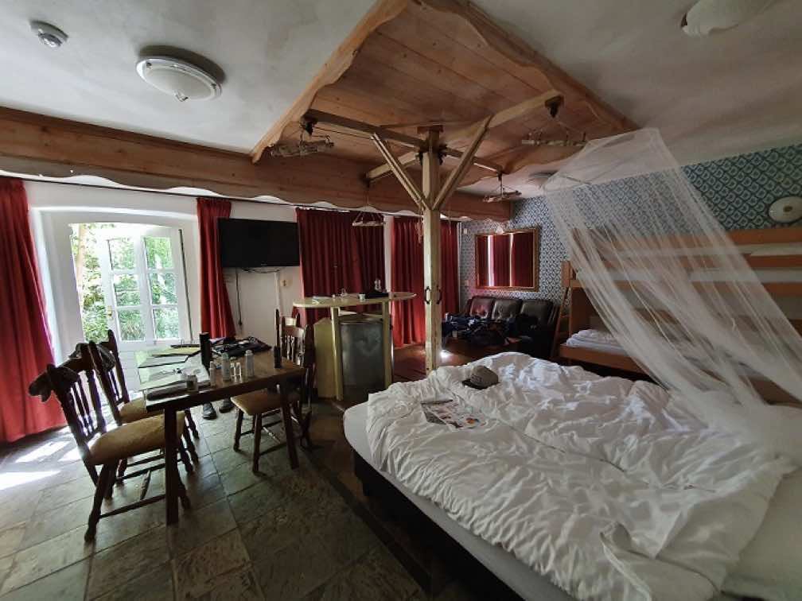
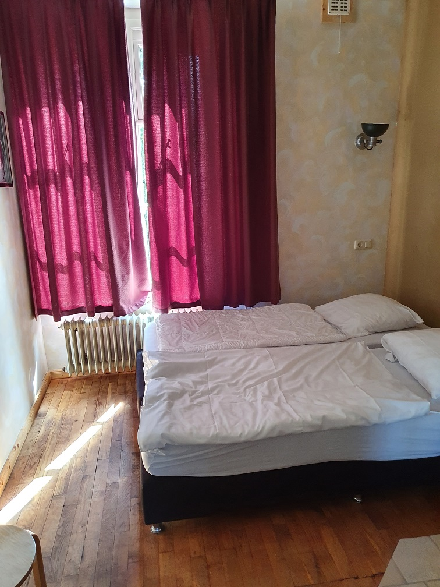

The site has ample accommodation for all of us, with many options for providing comfort and suiting a budget. There are 55 beds in dorms, or bedrooms that don't have a private bathroom. There are a further 109 beds in rooms that sleep 3 to 5 people, with ensuite/private bathrooms with showers, and there are 80 beds in double rooms, also with en suite/private toilets/showers. Bedding and towels are provided at no additional charge for all attendees who reserve a bed, whether in dorm, small room, or double room- this is a level of options and luxury that we don't usually get at our events and we're happy to offer for 30 Year!

For information on pricing and how to book these rooms, see our Registration page.

  <a href="" class="btn btn-primary">Registration &amp; pricing</a>

### Accessibility

The site is on even ground with all buildings and activity areas fairly close together, with many paved walkways.  The main building with all bedrooms and activity rooms has lifts/elevators to each floor, and the hallways and doors are wide enough to accommodate wheelchairs.  Dining areas are on the ground floor and are accessible by wheelchair.  Most rooms have their own private/ensuite toilet and shower, and the public bathrooms and showers at the site have wider accessible stalls available.  Low ramps are in place for easier entry into buildings that have steps.  Pets are not allowed but guide/service dogs are.  If you have any further accessibility questions or needs, please contact us at [dw30year@gmail.com](mailto:dw30year@gmail.com) and we will assist.  A section regarding accessibility needs/requests will also be included on the reservation form.

  

 

  

 

  

 

  

 

  <a href="/" class="btn btn-primary">Return to the front page</a>

